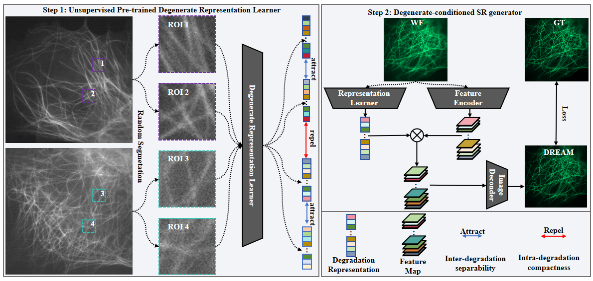

# DREAM

DREAM is a deep-learning framework for fluorescence microscopy image restoration and super-resolution. The project consists of two coupled components: a degradation representation learner and a degradation-conditioned SR generator.



## Repository Structure

```text
.
+-- data/
|   +-- dataset_DREAM.py          # DREAM paired WF/GT dataset
|   +-- select_dataset.py         # Dataset selector
+-- models/
|   +-- network_DREAM.py          # DREAM generator and encoder
|   +-- model_gan_DREAM.py        # GAN training and inference wrapper
|   +-- network_discriminator.py  # Discriminator definitions
|   +-- select_network.py         # Network selector
+-- options/
|   +-- train_DREAM_sr_x2_gan.json
|   +-- test_DREAM_sr_x2_gan.json
+-- testdata/
|   +-- ER/
|   +-- MTs/
+-- weights/
|   +-- ER.pth
|   +-- MTs.pth
+-- result/                       # Inference outputs
+-- main_train_gan_DREAM.py
+-- main_test_gan_DREAM.py
```

## Installation

Create a Python environment and install the required packages.

```bash
conda create -n dream python=3.10
conda activate dream
pip install torch torchvision numpy scipy scikit-image imageio opencv-python tqdm
```

## Data Preparation

The dataset loader expects paired `.tif` files. WF and GT images should have matching file names.

```text
dataset_root/
+-- WF/
|   +-- 1.tif
|   +-- 2.tif
|   +-- ...
+-- GT/
    +-- 1.tif
    +-- 2.tif
    +-- ...
```

For training, update `options/train_DREAM_sr_x2_gan.json`:

```json
"dataroot_H": "path/to/GT",
"dataroot_L": "path/to/WF"
```

For testing, update `options/test_DREAM_sr_x2_gan.json`:

```json
"path": {
  "pretrained_netG": "weights/MTs.pth"
},
"datasets": {
  "test": {
    "dataroot_H": "testdata/MTs/GT",
    "dataroot_L": "testdata/MTs/WF"
  }
}
#If there is no GT, then set dataroot_H to be the same as dataroot_L.
```


## Training

Run:

```bash
python main_train_gan_DREAM.py --opt options/train_DREAM_sr_x2_gan.json
```

Training outputs are saved under the configured training task directory:

```text
DREAM_GAN_MTs/
+-- dream_sr_x2_gan/
    +-- images/
    +-- models/
    +-- options/
    +-- train.log
```

The script automatically resumes from the latest checkpoint in the training `models/` directory when available.

## Testing

Run: Download the [pre-trained model](https://doi.org/10.6084/m9.figshare.33085976) and place it in the weights folder.

```bash
python main_test_gan_DREAM.py --opt options/test_DREAM_sr_x2_gan.json
```

Testing results are saved directly to:

```text
result/
```

The testing script does not create a new task folder from the configuration file.


## Configuration

Important options are stored in JSON files under `options/`.

| Option | Description |
| --- | --- |
| `scale` | Super-resolution scale factor |
| `n_channels` | Number of image channels |
| `dataroot_H` | GT image directory |
| `dataroot_L` | WF image directory |
| `pretrained_netG` | Generator checkpoint used for inference |
| `checkpoint_print` | Training log interval |
| `checkpoint_save` | Model checkpoint interval |
| `checkpoint_test` | Validation interval during training |

